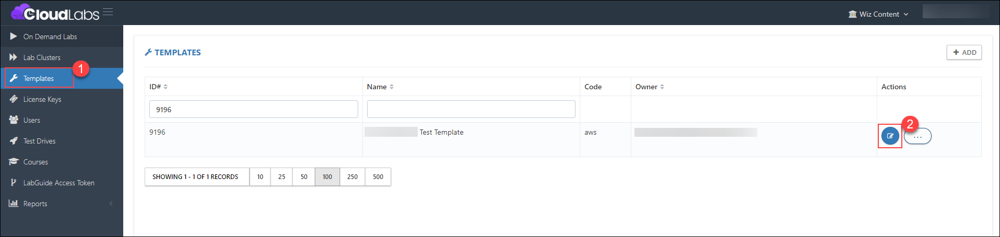
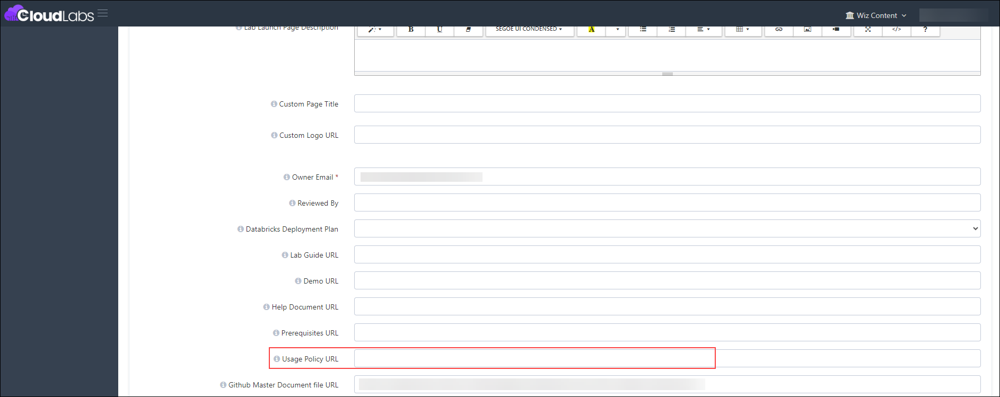
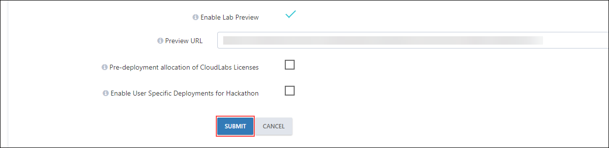
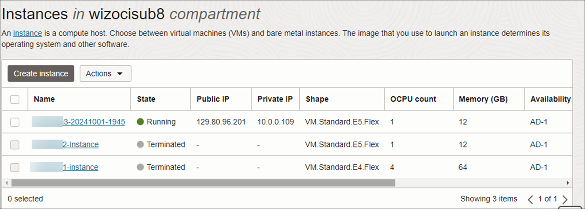
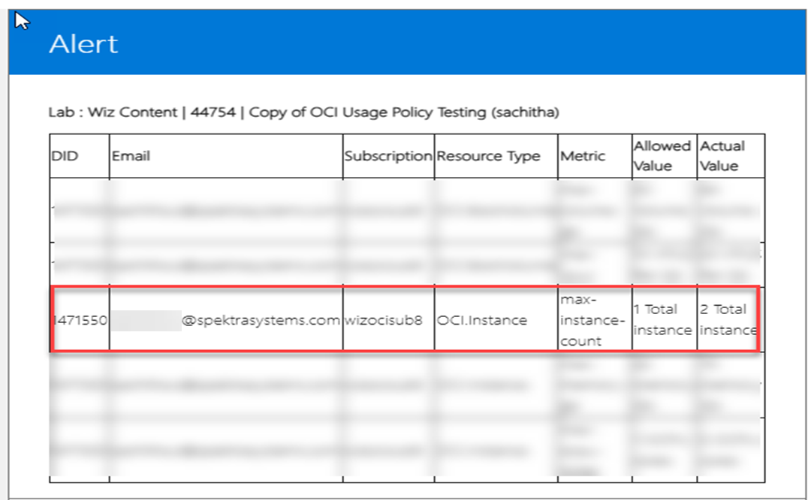
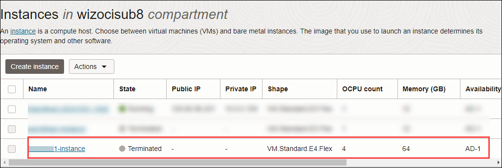
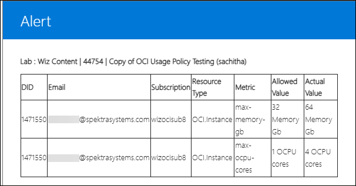
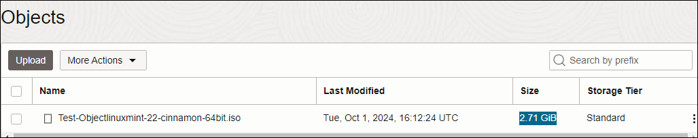

# OCI Resource Usage Policy

### Overview

OCI Resource Usage Policy is used to monitor the cores and clusters of OCI resources that are predefined for a user.

### Prerequisites

- Before adding the OCI Resource Usage Policy in the Template, ensure you have the following prerequisites:      
  
  Admin access to [CloudLabs Admin Portal](https://admin.cloudlabs.ai/) (If access is unavailable, kindly reach out to your point of contact or [CloudLabs Support](https://docs.cloudlabs.ai/RequestSupport)).

### Adding OCI Resource Usage Policy

1. Log in to the CL portal and navigate to the required tenant (WIZ). On the left-hand side of the page, you will see the Template section.

2. Navigate to the **Templates (1)** section in the left menu and click on the **edit (2)** button.

   

3. Scroll down to the **Usage Policy** section and provide the Usage Policy URL for the respective OCI resource. 
   
   

4. Then, click the **Submit** button.

   

### Usage Policy Uand Alerts Outputs

- Below are the Resource Usage Policy and Alerts outputs for the respective resources.

  1. **Instance:** The metric used is the **count of instances.**

     - Policy:

      ```
      [
        {
          "ResourceType": "OCI.Instance",
      
          "Parameter": [
            {
              "Name": "max-ocpu-cores",
      
              "Value": "1"
            },
      
            {
              "Name": "max-memory-gb",
      
              "Value": "32"
            },
      
            {
              "Name": "max-instance-count",
      
              "Value": "1"
            }
          ]
        }
      ] 
      ```

     - Output:
       Cloud Screenshot: 

       

       Alerts Received: 
        
       

  2. **Instance:** The metrics used are **OCPU Cores** and **Memory (GB).**

     - Output:
       Cloud Screenshot: 

       

       Alerts Received: 

       

  3. **Bucket:** The metric used is the Storage (GB).   

     - Policy:

      ```
      [
        {
        "ResourceType": "OCI.Bucket",
        "Parameter": [
            {
            "Name": "max-storage-gb",
            "Value": "1"
            }
          ]
        }
      ]
      ```

     - Output:
       Cloud Screenshot: 

       

       Alerts : Not received.

  4. **Boot Volume:** The metric used is VPUs (per GB) and Volume (GB).


      
